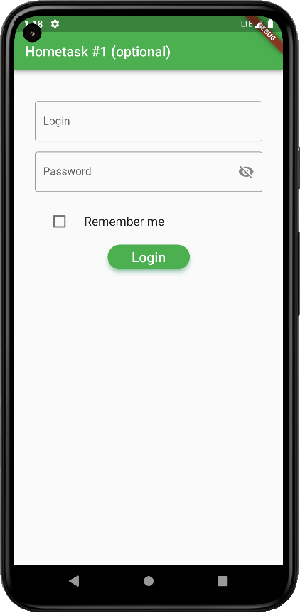

# hometask_1_optional

Login app with function "Remember user" and logout.

Also used Splash screen (3 seconds duration) when app is initialized.

For implementation 'remember' function used Shared Prefecrences library from
pub.dev.

For login use:
Login: admin
Password: 123456

